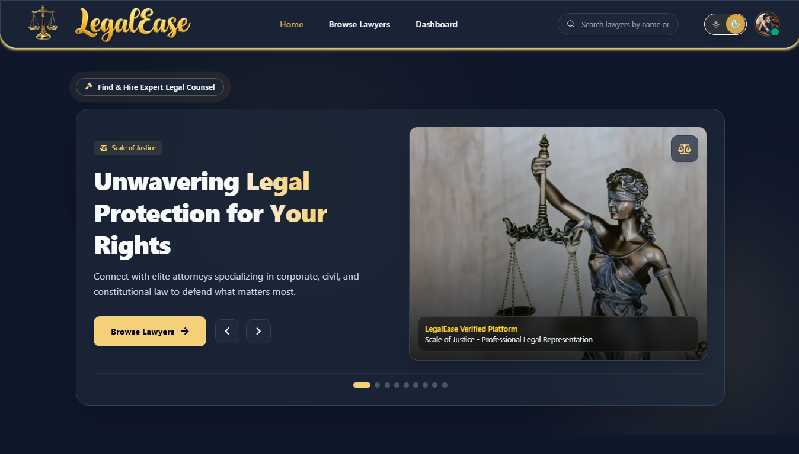
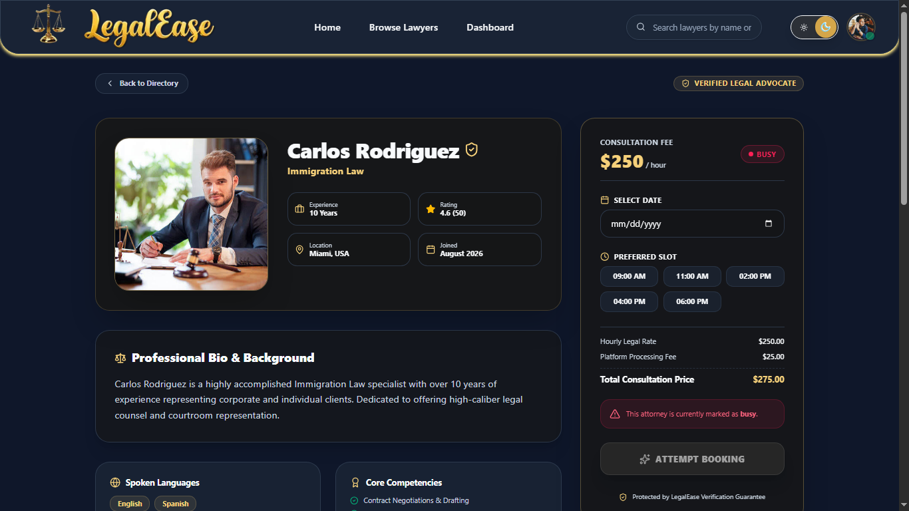
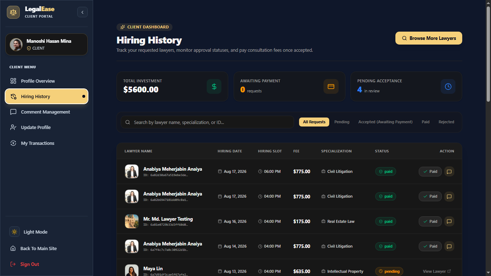

# ⚖️ LegalEase — Online Lawyer Hiring Platform

<p align="center">
  <strong>A Modern Full-Stack Platform for Finding, Consulting & Hiring Verified Legal Professionals</strong>
</p>


# Website Live Link: https://legalease-online-lawyer-hiring-plat.vercel.app/


<p align="center">
  <em>Connecting valuable clients with trusted lawyers through a secure, transparent, and intuitive digital legal marketplace.</em>
</p>

<p align="center">


</p>

---

## 📖 Overview

**LegalEase** is a modern, real-life problem solver, full-stack **Online Lawyer Hiring Platform** designed to simplify the process of discovering, evaluating, consulting, and hiring legal professionals.

The platform creates a digital bridge between **Clients, Lawyers, and Administrators**, providing each role with dedicated functionality and access permissions.

Instead of relying on traditional methods of finding legal assistance, LegalEase provides a centralized platform where users can:

* 🔎 Discover lawyers by specialization and expertise
* 👨‍⚖️ Explore detailed lawyer profiles
* ⭐ Review ratings and verified client feedback
* 💼 Hire legal professionals for consultations
* 💳 Complete secure payment processes
* 📝 Submit reviews after verified engagements
* 📊 Track hiring and consultation history
* 🔐 Access role-specific dashboards
* 🛡️ Maintain secure authentication and authorization

> **LegalEase is built around one core idea: making professional legal assistance more accessible, transparent, and convenient.**

---

# 🎯 Project Goal

The primary goal of LegalEase is to **bridge the gap between people seeking legal assistance and qualified legal professionals** through a reliable digital marketplace.

Traditional lawyer discovery can involve:

* Limited information about lawyer expertise
* Difficulty comparing different professionals
* Unclear consultation pricing
* Lack of transparent client experiences
* Complicated communication and hiring procedures
* Manual verification and engagement tracking

LegalEase addresses these challenges by bringing the entire discovery and hiring process into a **Single, Structured, Secured platform**.

### Core Objectives

* **Simplify lawyer discovery**
* **Improve transparency through verified reviews**
* **Provide secure client-lawyer interactions**
* **Implement role-based access control**
* **Validate important actions through backend verification**
* **Provide a responsive and accessible user experience**
* **Create a scalable architecture for future legal services**

---

# 🌟 Key Features

## 👨‍⚖️ Advanced Lawyer Discovery

Clients can explore lawyers through informative profiles containing important professional information.

### Lawyer profiles can include:

* Lawyer name
* Professional profile image
* Practice area
* Legal specialization
* Professional experience
* Hourly consultation rate
* Professional background
* Ratings and reviews
* Availability status
* Verification status
* Contact / hiring actions

The discovery experience is designed to help users **compare legal professionals before making a hiring decision**.

---

## 🔍 Lawyer Search & Filtering

Users can efficiently discover suitable lawyers based on their legal requirements.

Potential filtering criteria include:

* Practice area
* Specialization
* Experience
* Pricing
* Rating
* Availability
* Verification status

This creates a more efficient experience than manually searching through unstructured lawyer listings.

---

# 👥 Role-Based Access Control

LegalEase supports multiple user roles with different permissions and responsibilities.

| Role                  | Responsibilities                                                                                 |
| --------------------- | ------------------------------------------------------------------------------------------------ |
| 👤 **Client**         | Discover lawyers, hire lawyers, make payments, submit verified reviews and manage hiring history |
| ⚖️ **Lawyer**         | Manage professional profile, services, availability and client engagements                       |
| 🛡️ **Admin** | Manage platform operations, users, lawyers, verification and system-level activities             |

### 🔐 Permission-Based Experience

Each role receives an appropriate dashboard and access level.

For example:

* Clients cannot access lawyer-only functionality.
* Lawyers cannot perform administrator operations.
* Administrative actions are restricted to authorized accounts.
* Review submission is restricted to eligible clients.

This prevents unauthorized actions while maintaining a clean user experience.

---

# ⭐ Verified Reviews & Ratings

LegalEase includes a review and rating system designed to promote **authentic client feedback**.

Users can:

* Submit ratings
* Write detailed feedback
* Read previous client experiences
* Evaluate lawyer professionalism
* Use reviews as part of their hiring decision

### Review Validation

Review submission is not treated as a simple public form.

The backend can verify whether the current user:

1. Has an authenticated session.
2. Has the correct **client role**.
3. Has a valid relationship with the lawyer.
4. Has completed or confirmed the required consultation/payment process.
5. Is eligible to submit feedback.

This approach helps reduce unauthorized or misleading reviews.

---

# 💳 Secure Hiring & Payment Flow

LegalEase integrates payment validation into the lawyer hiring workflow.

A typical hiring process follows:

```text
Client
  ↓
Browse Lawyers
  ↓
View Lawyer Profile
  ↓
Select Legal Service
  ↓
Confirm Hiring
  ↓
Payment / Verification
  ↓
Backend Validation
  ↓
Hiring Record Created
  ↓
Consultation / Legal Service
  ↓
Client Can Submit Verified Review
```

The backend acts as the **source of truth** for important payment and hiring states instead of relying exclusively on frontend information.

---

# 💬 Interactive Client Experience

LegalEase provides contextual UI feedback through interactive components.

Examples include:

* Payment alert modals
* Login prompts
* Permission restriction cards
* Hiring confirmation dialogs
* Availability notifications
* Success/error messages
* Toast notifications
* Review submission feedback

These interactions help users understand **why an action is available, restricted, or unsuccessful**.

---

# 🔔 Notifications & Alerts

The application uses contextual notifications to communicate important actions.

Examples:

* Successful hiring
* Payment status
* Review submission
* Authentication status
* Invalid actions
* Restricted functionality
* Backend/API errors

The interface is designed to provide immediate feedback without forcing users to navigate away from their current page.

---

# 🌓 Light & Dark Mode

LegalEase supports a polished **light/dark theme experience**.

The interface is designed around a professional legal-business visual identity featuring:

* Deep navy primary tones
* Elegant gold accents
* Neutral backgrounds
* High-contrast typography
* Subtle borders
* Modern cards
* Glassmorphism-inspired components

### 🎨 Brand Color Direction

| Purpose          | Color     |
| ---------------- | --------- |
| Primary          | `#0B1F36` |
| Secondary / Gold | `#D4A64A` |
| Accent           | `#F5D07A` |
| Light Background | `#FAF8F4` |
| Surface          | `#FFFFFF` |
| Dark Surface     | `#102A43` |
| Primary Text     | `#111827` |
| Secondary Text   | `#6B7280` |
| Success          | `#16A34A` |
| Warning          | `#F59E0B` |

The color system creates a visual identity that communicates **Trust, Professionalism, Authority, and Premium legal services**.

---

# 📱 Responsive Design

LegalEase follows a **mobile-first responsive design philosophy**.

The interface is designed to work across:

* 📱 Mobile phones
* 📲 Tablets
* 💻 Laptops
* 🖥️ Desktop monitors

Responsive behavior is applied to:

* Navigation
* Lawyer cards
* Profile pages
* Dashboards
* Forms
* Modals
* Tables
* Hiring history
* Review sections

---

# 🔐 Authentication & Session Management

LegalEase implements secure authentication and session-aware functionality.

The application uses **cookie-based session handling** between the frontend and backend.

Authenticated requests can include credentials through:

```javascript
credentials: "include"
```

This allows the backend to identify the current authenticated user while keeping sensitive authentication information out of client-side application state.

### Authentication Responsibilities

* User authentication
* Session management
* Protected routes
* Role verification
* Secure API requests
* Permission enforcement
* Session-aware UI

---

# 🛡️ Security & Access Control

Security is treated as a **backend responsibility**, not only a frontend feature.

### Security mechanisms include:

* 🔐 Authentication-based access
* 👥 Role-based authorization
* 🍪 Secure session cookies
* 💳 Backend payment validation
* 📝 Verified review eligibility
* 🚫 Restricted administrative actions
* 🔎 Server-side resource validation
* 🧩 Protected API endpoints
* 🛡️ Input and request validation

> **Frontend restrictions improve UX, but backend authorization provides the actual security boundary.**

---

# 🏗️ Application Architecture

LegalEase follows a modern **separated frontend/backend architecture**.

```text
                    ┌─────────────────────┐
                    │      Client         │
                    │  Browser / Mobile   │
                    └──────────┬──────────┘
                               │
                               ▼
                    ┌─────────────────────┐
                    │      Next.js        │
                    │ Frontend Application│
                    └──────────┬──────────┘
                               │
                         HTTP / API
                               │
                               ▼
                    ┌─────────────────────┐
                    │     Express.js      │
                    │     REST Backend    │
                    └──────────┬──────────┘
                               │
               ┌───────────────┼───────────────┐
               ▼               ▼               ▼
        ┌────────────┐  ┌────────────┐  ┌────────────┐
        │  MongoDB   │  │   Auth     │  │  Payment   │
        │  Database  │  │  Session   │  │ Validation │
        └────────────┘  └────────────┘  └────────────┘
```

This separation makes the application easier to maintain, test, secure, and scale.

---

# 🛠️ Technology Stack

## Frontend

| Technology          | Purpose                                 |
| ------------------- | --------------------------------------- |
| **Next.js**         | React framework and application routing |
| **React**           | Component-based UI development          |
| **Tailwind CSS**    | Utility-first styling                   |
| **HeroUI**          | UI components                           |
| **Lucide React**    | Interface icons                         |
| **React Hot Toast** | Notifications                           |
| **Framer Motion**   | UI animations                           |
| **Next Themes**     | Light/dark theme management             |

## Backend

| Technology                    | Purpose                       |
| ----------------------------- | ----------------------------- |
| **Node.js**                   | JavaScript runtime            |
| **Express.js**                | REST API server               |
| **MongoDB**                   | NoSQL database                |
| **MongoDB Driver / Mongoose** | Database interaction          |
| **dotenv**                    | Environment configuration     |
| **CORS**                      | Cross-origin request handling |

## Development & Deployment

| Tool       | Purpose             |
| ---------- | ------------------- |
| **Git**    | Version control     |
| **GitHub** | Source code hosting |
| **Vercel** | Frontend deployment |
| **Render** | Backend deployment  |
| **npm**    | Package management  |

---

# 📁 Project Structure

```text
legalease/
│
├── app/
│   ├── (main)/
│   │   ├── lawyers/
│   │   ├── dashboard/
│   │   └── ...
│   │
│   ├── (auth)/
│   │   ├── login/
│   │   ├── register/
│   │   └── ...
│   │
│   ├── layout.jsx
│   └── page.jsx
│
├── components/
│   ├── Navbar/
│   ├── LawyerCard/
│   ├── CommentsSection/
│   ├── PaymentAlertModal/
│   ├── HiringHistory/
│   └── ...
│
├── lib/
│   ├── api/
│   │   ├── baseUrl.js
│   │   └── ...
│   │
│   ├── auth-client.js
│   ├── auth.js
│   └── ...
│
├── public/
│   ├── images/
│   ├── icons/
│   └── branding/
│
├── styles/
│   └── globals.css
│
├── package.json
├── next.config.js
├── tailwind.config.js
├── .env.local
├── .gitignore
└── README.md
```

> **Note:** The exact folder structure may vary depending on the current implementation and future project expansion.

---

# 🗄️ Core Data Models

The platform can be organized around several core collections/entities.

### 👤 Users

Stores account and authentication-related information.

Typical fields:

```text
_id
name
email
role
profileImage
createdAt
updatedAt
```

### ⚖️ Lawyers

Stores professional information.

Typical fields:

```text
_id
name
email
specialization
practiceArea
experience
hourlyRate
profileImage
bio
rating
availability
verified
createdAt
updatedAt
```

### 💼 Hiring

Stores client-lawyer engagement information.

Typical fields:

```text
_id
clientId
lawyerId
serviceId
paymentStatus
hiringStatus
amount
createdAt
updatedAt
```

### ⭐ Reviews / Comments

Stores client feedback.

Typical fields:

```text
_id
lawyerId
clientId
rating
comment
createdAt
updatedAt
```

### ⚖️ Services

Stores lawyer-specific legal services.

Typical fields:

```text
_id
lawyerId
title
description
category
price
duration
createdAt
updatedAt
```

---

# 🔄 Main User Workflow

## Client Journey

```text
Register / Login
       ↓
Explore Lawyers
       ↓
Filter / Search
       ↓
Open Lawyer Profile
       ↓
Review Experience & Ratings
       ↓
Select Service
       ↓
Hire Lawyer
       ↓
Payment / Verification
       ↓
Consultation
       ↓
Hiring History
       ↓
Submit Verified Review
```

## Lawyer Journey

```text
Register / Login
       ↓
Create Professional Profile
       ↓
Add Specialization & Services
       ↓
Set Pricing & Availability
       ↓
Complete Verification
       ↓
Receive Client Hiring Requests
       ↓
Manage Legal Engagements
```

## Administrator Journey

```text
Admin Login
     ↓
Administrative Dashboard
     ↓
Manage Users
     ↓
Manage Lawyers
     ↓
Review Verification
     ↓
Monitor Hiring Activities
     ↓
Manage Platform Operations
```

---

# 🌐 API Architecture

The backend exposes REST-style API endpoints for communication between the frontend and server.

Example endpoint structure:

```text
/api/auth/*
/api/lawyers
/api/lawyers/:id
/api/services
/api/hiring
/api/comments
/api/reviews
/api/users
```

### Example Request

```http
GET /api/lawyers/:id
```

### Example Response

```json
{
  "success": true,
  "data": {
    "id": "64xxxxxxxxxxxx",
    "name": "John Doe",
    "specialization": "Corporate Law",
    "experience": 8,
    "hourlyRate": 120
  }
}
```

> API routes should validate authentication, authorization, request parameters, and database resources before performing protected operations.

---

# ⚙️ Environment Variables

Create a `.env.local` file in the frontend project:

```env
NEXT_PUBLIC_API_URL=http://localhost:5000
```

For the backend, configure the required environment variables according to your server configuration.

Example:

```env
PORT=5000
MONGO_DB_URI=your_mongodb_connection_string
CLIENT_URL=http://localhost:3000
```

### ⚠️ Important

**Never commit secrets to GitHub.**

Add environment files to `.gitignore`:

```gitignore
.env
.env.local
.env.*.local
```

---

# 🚀 Getting Started

## Prerequisites

Make sure the following are installed:

* **Node.js 18+**
* **npm**, **yarn**, or **pnpm**
* **MongoDB / MongoDB Atlas**
* **Git**

---

## 1. Clone the Repository

```bash
git clone https://github.com/Pinon1345/LegalEase-Online-Lawyer-Hiring-Platform.git
cd legalease
```

---

## 2. Install Dependencies

```bash
npm install
```

Or:

```bash
yarn install
```

Or:

```bash
pnpm install
```

---

## 3. Configure Environment Variables

Create:

```text
.env.local
```

Then add:

```env
NEXT_PUBLIC_API_URL=http://localhost:5000
```

Configure the backend environment separately.

---

## 4. Start the Development Server

```bash
npm run dev
```

The frontend will normally be available at:

```text
http://localhost:3000
```

Start the Express backend according to its configured development script, commonly:

```bash
npm run dev
```

or:

```bash
node server.js
```

---

# 📦 Available Scripts

Typical Next.js scripts include:

```bash
npm run dev
```

Starts the development server.

```bash
npm run build
```

Creates an optimized production build.

```bash
npm start
```

Runs the production server.

```bash
npm run lint
```

Runs the project's linting process.

---

# 💡 Design Philosophy

LegalEase was designed around four major principles:

### 01 — Trust

Legal services require confidence. Verified profiles, transparent information, ratings, and structured hiring help establish trust.

### 02 — Simplicity

Users should be able to find the right lawyer without navigating through complicated workflows.

### 03 — Security

Authentication, authorization, payment validation, and server-side checks protect sensitive operations.

### 04 — Professionalism

The visual language combines **deep navy, elegant gold accents, modern typography, responsive layouts, and subtle animations** to create a premium legal-service experience.

---

# ✨ UI/UX Highlights

* Premium legal-business visual identity
* Responsive navigation
* Modern lawyer cards
* Professional profile layouts
* Glassmorphism-inspired components
* Smooth hover interactions
* Dark/light theme support
* Interactive modals
* Toast notifications
* Loading and empty states
* Error handling states
* Responsive dashboards
* Accessible iconography
* Mobile-first layouts
* Consistent spacing and typography

---

# 🧪 Validation & Error Handling

The platform is designed to handle common application states including:

* Unauthorized users
* Invalid sessions
* Missing resources
* Unavailable lawyers
* Failed payments
* Duplicate review attempts
* Invalid form submissions
* API failures
* Database errors
* Restricted role actions
* Empty search results

Meaningful feedback is provided to users through **alerts, modals, toast notifications, and dedicated UI states**.

---

# 🔒 Security Best Practices

LegalEase follows several security-oriented development principles:

* Never expose database credentials to the frontend.
* Keep secrets inside environment variables.
* Validate protected operations on the server.
* Do not trust client-provided roles.
* Validate authenticated sessions.
* Validate ownership before modifying resources.
* Verify payment/hiring status server-side.
* Restrict administrative APIs.
* Avoid exposing unnecessary database fields.
* Sanitize and validate user-provided data.
* Configure CORS appropriately for production.

---

# 📈 Future Improvements

LegalEase can be extended into a larger legal-service ecosystem.

### Planned / Possible Improvements

* [ ] Real-time client-lawyer messaging
* [ ] Video consultation integration
* [ ] Lawyer availability calendar
* [ ] Appointment scheduling
* [ ] Advanced lawyer search
* [ ] Email notifications
* [ ] SMS notifications
* [ ] Lawyer document verification
* [ ] Digital contracts
* [ ] Invoice generation
* [ ] Advanced admin analytics
* [ ] Lawyer earnings dashboard
* [ ] Client notification center
* [ ] Saved / favorite lawyers
* [ ] Multi-language support
* [ ] AI-powered legal service discovery
* [ ] Automated appointment reminders
* [ ] Advanced payment/refund management
* [ ] Production-grade audit logging

---

# 🏆 Project Highlights

LegalEase demonstrates practical implementation of several modern web-development concepts:

**Full-Stack Development**
Frontend and backend applications working together through REST APIs.

**Authentication & Authorization**
Session-based authentication combined with role-specific permissions.

**Database Design**
Structured MongoDB collections for users, lawyers, services, hiring records, and reviews.

**Payment-Aware Workflows**
Backend validation of payment and consultation-related operations.

**Responsive UI Engineering**
Mobile-first layouts that adapt across different screen sizes.

**Component-Based Architecture**
Reusable React components for consistent UI development.

**API Integration**
Frontend communication with an Express.js backend.

**Security-Oriented Development**
Server-side authorization and validation for protected operations.

---

# 📸 Screenshots

Add screenshots of the major application sections here.

Recommended screenshots:

1. 🏠 Landing Page
2. ⚖️ Lawyer Listing
3. 👨‍⚖️ Lawyer Profile
4. 💳 Hiring / Payment
5. ⭐ Review Section
6. 📊 Client Dashboard
7. 📋 Hiring History
8. 🛡️ Admin Dashboard
9. 🌙 Dark Mode

Example:

```markdown
## 📸 Screenshots

### Homepage



### Lawyer Profile



### Hiring History


```

---

# 🤝 Contributing

Contributions, suggestions, and improvements are welcome.

### Contribution Workflow

```bash
# Fork the repository

# Create a feature branch
git checkout -b feature/AmazingFeature

# Make your changes

# Commit your changes
git commit -m "Add AmazingFeature"

# Push the branch
git push origin feature/AmazingFeature
```

Then open a **Pull Request**.

### Contribution Guidelines

Please ensure that contributions:

* Follow the existing project structure.
* Maintain consistent coding standards.
* Include appropriate validation.
* Do not expose sensitive credentials.
* Do not introduce unnecessary dependencies.
* Include documentation when introducing major functionality.

---

# 🐛 Bug Reports & Feature Requests

If you discover a bug or have an idea for improving LegalEase, please create an issue with:

* **Problem description**
* **Steps to reproduce**
* **Expected behavior**
* **Actual behavior**
* **Screenshots**, if applicable
* **Browser / device information**

For feature requests, explain the proposed functionality and the problem it solves.

---

# 👨‍💻 Author

## **FOURKAN BIN ILIAS**

**Full-Stack Web Developer | BBA Student | Programmer | Developer & Designer**

📍 Chittagong, Bangladesh

I enjoy building modern web applications, exploring new technologies, developing user-focused interfaces, and solving real-world problems through software.

### Connect With Me

* **GitHub:** [@Pinon1345](https://github.com/Pinon1345)
* **LinkedIn:** [Fourkan Bin Ilias](https://www.linkedin.com/in/fourkan-bin-ilias-6117b0347/)
* **Portfolio:** [Fourkan Bin Ilias](https://fourkan-bin-ilias-portfolio.vercel.app/)
* **Email:** [pinonfurkan1@gmail.com](mailto:pinonfurkan1@gmail.com)

---

# 📜 License

This project is distributed under the **MIT License**.

See the `LICENSE` file for more information.

---

# ⭐ Support the Project

If you find **LegalEase** useful or interesting, consider giving the repository a ⭐ **star on GitHub**.

Your support helps encourage further development and improvement.

---

<p align="center">

### ⚖️ LegalEase

**Find. Consult. Hire. Trust.**

<em>Modern technology for a simpler legal experience.</em>

</p>

---

<p align="center">
  Built with ❤️ using <strong>Next.js • React • Node.js • Express.js • MongoDB • Tailwind CSS</strong>
</p>
